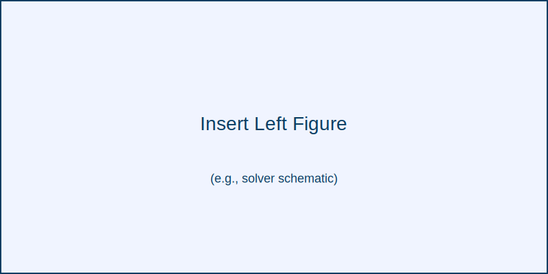
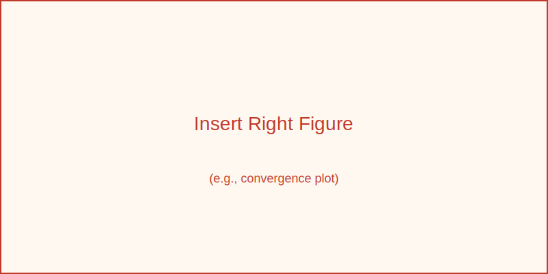

# Wave-Based Stochastic Solvers

<div align="center">
  
  
</div>

## Overview
This repository consolidates the MATLAB implementations that accompany the thesis *Scalable Domain Decomposition Methods for Nonlinear and Time-Dependent Stochastic Systems*. The projects cover intrusive and non-intrusive stochastic finite element solvers, domain decomposition strategies, Monte Carlo studies, and reference data for both one-dimensional and two-dimensional acoustic wave problems.

The codebase has been reorganized to keep artifacts in a predictable layout:

```
.
├── projects
│   ├── 1d
│   │   └── 1dwave
│   └── 2d
│       ├── RV_2Dresults
│       ├── acoustic_DDM_verification
│       ├── acoustic_wave
│       ├── wave_DirectDDM
│       ├── wave_LNP_TwoLevel
│       ├── wave_Lumped
│       ├── wave_MCS_RV
│       ├── wave_NISP_process
│       ├── wave_Neumann
│       ├── wave_RV
│       └── wave_TwoLevel
└── resources
    └── misc
```

- `projects/1d` contains the complete one-dimensional solver suite (deterministic, intrusive, Monte Carlo, and NISP variants) plus generated 1D figures/results.
- `projects/2d` holds the two-dimensional acoustic wave solvers, verification studies, Monte Carlo runs, and post-processing utilities.
- `resources/misc` stores auxiliary scripts (e.g., Cijk utilities) and analytical comparison figures shared across projects.

## Project Highlights

### 1D suite (`projects/1d/1dwave`)
| Module | Purpose | Notable contents |
| --- | --- | --- |
| `wave_direct` | Baseline deterministic solver for axial bar dynamics. | Ready-to-plot `.fig` outputs (e.g., `dx01deltaT002EA5.fig`). |
| `wave_MCS` | Monte Carlo sampling with bootstrap studies. | `results/` with convergence studies and experiment scripts. |
| `wave_NISP` | Non-intrusive spectral projection workflows. | Companion scripts (`wave_NISP.m`, `wave_NISP_newimplementation.m`) that reuse stiffness assembly helpers. |
| `wave_Intrusive` | Intrusive polynomial chaos implementation. | `Assemble_stochastic.m`, `Cijk030001.mat`, and `Results/` snapshots. |
| `wave_DDM` | Simple 1D domain decomposition demonstrator. | `wave_direct.m` + acceleration utilities. |
| `1dMCS_gmsh` | Helper utilities to build meshes and inputs for Monte Carlo experiments. | `axialbar.geo/msh`, node/element tables, and extraction scripts. |
| `results` | Shared figures/tables cited across subprojects. | PCA figures, mean/SD plots, and convergence diagnostics. |

### 2D suite (`projects/2d`)
| Folder | Focus | Key elements |
| --- | --- | --- |
| `acoustic_wave` | Full pipeline for 2D wave propagation (mesh, data, source, FEniCS verification). | `code_verification/`, deterministic `data/`, and source configuration scripts. |
| `acoustic_DDM_verification` | Deterministic verification of DDM implementations with Schur-complement diagnostics. | Precomputed interface matrices and figure outputs (e.g., `match_01_DDM.fig`). |
| `wave_DirectDDM` | Direct domain decomposition solver with coarse grid and preconditioner experiments. | `A_*.mat`, `Bt_*`, `Kt_*`, plus solver scripts (`DoPCGM_*`, `GetCoarseGrid.m`). |
| `wave_LNP_TwoLevel` | Two-level Neumann–Neumann solvers with lognormal parameters. | Hybrid solvers, preconditioners, and `results/GaussianPulse_nodamp_233_01/` outputs. |
| `wave_Lumped` | Lumped-mass variants storing hundreds of assembled matrices (`A_*`, `M_*`). | Dataset for testing mass-lumped preconditioners. |
| `wave_MCS_RV` | Monte Carlo solver for random variables with stored result sets (`results/2000_sd_1_nodamp`, etc.). | Mesh extractions (`ExtractGmsh.m`) and geometry tables. |
| `wave_NISP_process` | Workflow for NISP processing and visualization. | Multiple `mindex*.dat` files, norm snapshots, and plotting figures. |
| `wave_Neumann` | Pure Neumann preconditioner experiments mirroring `wave_Lumped` data volume. | `A_*` and `M_*` archives plus solver scripts. |
| `wave_RV` | Random-variable-driven direct solvers with deterministic (`AbDet`) and stochastic (`AbSto`) datasets. | Rich `results/` directory for Gaussian pulse cases. |
| `wave_TwoLevel` | Full two-level hierarchy storing assembled coarse/fine matrices. | Extensive `A_*`/`M_*` collections used for parametric sweeps. |
| `RV_2Dresults` | Lightweight post-processing scripts and figures that summarize random-variable experiments. | `compare_2D.m` and exported mean/SD figures. |

### Shared resources (`resources/misc`)
Contains helper scripts for constructing Cijk tensors, analytical comparison `.fig` files, and quick-and-dirty prototyping scripts (e.g., `batch_converegence.m`). These utilities are intentionally decoupled from the project directories so they can be reused globally.

## Getting Started
1. Clone or download this repository and ensure MATLAB R2019b (or newer) is available.
2. Choose a study from `projects/1d` or `projects/2d`, open the relevant `.m` driver (for example, `projects/1d/1dwave/wave_MCS/wave_MCS.m`).
3. Adjust solver parameters in the corresponding script sections (time step, number of samples, stochastic dimension, etc.).
4. Run the script from MATLAB. Outputs are written back into each module’s `results/` directory so they stay co-located with the driving code.

> **Tip:** the repository is intentionally data-light. Large `.mat` artifacts have been removed and should be regenerated by running the appropriate driver scripts.

## Reference

> **[Scalable Domain Decomposition Methods for Nonlinear and Time-Dependent Stochastic Systems](https://doi.org/10.22215/etd/2023-15817)**
>
> **Authors:** Vasudevan, Padillath and Sharma, Sudhi  
> **Institution:** Carleton University (2023)  
> **DOI:** [10.22215/etd/2023-15817](https://doi.org/10.22215/etd/2023-15817)
>
> <details>
> <summary><b>Click to expand BibTeX citation</b></summary>
>
> ```bibtex
> @phdthesis{vasudevan2023scalable,
>   title={Scalable Domain Decomposition Methods for Nonlinear and Time-Dependent Stochastic Systems},
>   author={Vasudevan, Padillath and Sharma, Sudhi},
>   year={2023},
>   school={Carleton University},
>   doi={10.22215/etd/2023-15817}
> }
> ```
> </details>

## How to Contribute
- File an issue describing the solver or dataset you want to extend.
- Follow MATLAB best practices (function headers, input validation) when adding new scripts.
- Keep generated `.mat` files out of version control—store them under `results/` locally and add them to `.gitignore` if needed.

## License
If this repository requires a license, add the preferred terms here. Until then, treat the code as all-rights-reserved and contact the authors listed in the reference for reuse permissions.
